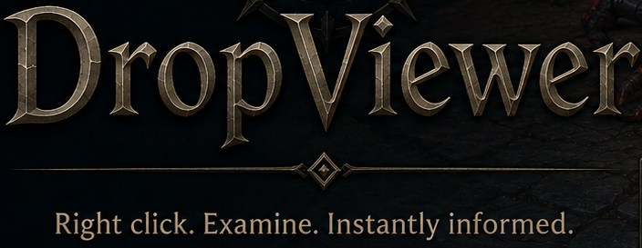
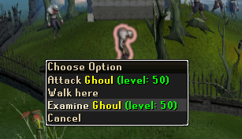
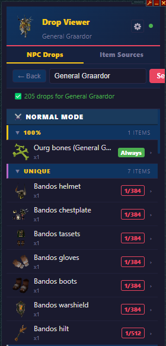
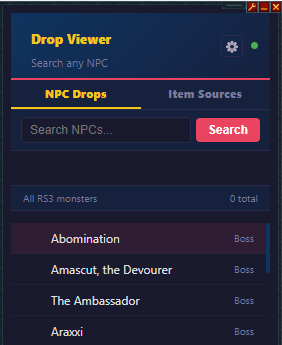

#  DropViewer - *V1.5*

> Your in-game knowledge companion  
> Instant lookups. Seamless integration. Zero interruption.

---

##  What Is It?

**DropViewer** transforms the way players interact with the game.

Right click anything.  
Pull up the information you need instantly.  
Stay immersed while getting answers in seconds.

Whether you are exploring, grinding, bossing, trading, or learning something new, this plugin keeps the information exactly where you need it.

---

##  How DropViewer Works

Right Click Anything → Hover Examine → Press "Alt + 1" → Instant Information 

---

## Key Features

<table>
<tr>
<td width="50%">

### 🔍 Instant Examine Lookup
Quickly inspect NPCs and items directly from the game.

</td>
<td width="50%">

### 📚 Rich Information Panels
View detailed drops lists, including drop rates.

</td>
</tr>

<tr>
<td width="50%">

### 🎯 Seamless In-Game Companion
No alt-tabbing. No searching manually.  Everything appears exactly when you need it.

</td>
<td width="50%">

### 🧠 Smart Context Detection
Automatically identifies what you are examining and surfaces the relevant data.

</td>
</tr>
</table>

---

##  Media

| Example | Description |
|---|---|
|  | Fast in-game examination |
|  | Detailed information panels |
|  | Smooth companion interface |

---

##  Why you'll love it

✅ Saves time  
✅ Great for single monitor gameplay  
✅ Makes learning effortless  
✅ Designed for convenience  
✅ Saves having a list of browser tabs open

---

##  Perfect For

- New players learning the game
- Experienced players optimizing efficiency
- Completionists hunting information
- PvM and bossing enthusiasts
- Anyone tired of alt-tabbing constantly

---

# Updates 
---
## March 19, 2026
### V1.0 - Initial Release
- Base version of OCR, using Tesseract 
- Pure HTML data scraping for drop rates

---

## March 21, 2026
### V1.25 - Bug fixes, and slight improvements
- Fixed bugs pertaining to OCR range
- Added "Item Sources" page, to look up all sources of drops directly
- Started adjustments into transitioning to Bucket API
- Started adjustments into rewriting OCR subsystem
- Removed close button if using Alt 1
---
## March 23, 2026
### V1.5 - OCR overhaul, and Bucket API calls
- Implemented Alt 1 OCR natively, using revived code from Alt1 - Electron
- Converted drop lookup to HTML - Bucket hybrid (HTML for grouping)
- Added new settings options
- Added temporary page memory
- Added ability to swap between NPC and Drop Sources
- Simplified Alt1 detection, reduced button size
- Relocated back button for easier use
---
# Planned Updates
---
- Themes / Recolor options
- Potentially collection log tracking
---
## If you have any ideas for additions, find any bugs, or want to share feedback 
- Message "The Riptide" ingame 
- Comment on any of the DropViewer Reddit posts
